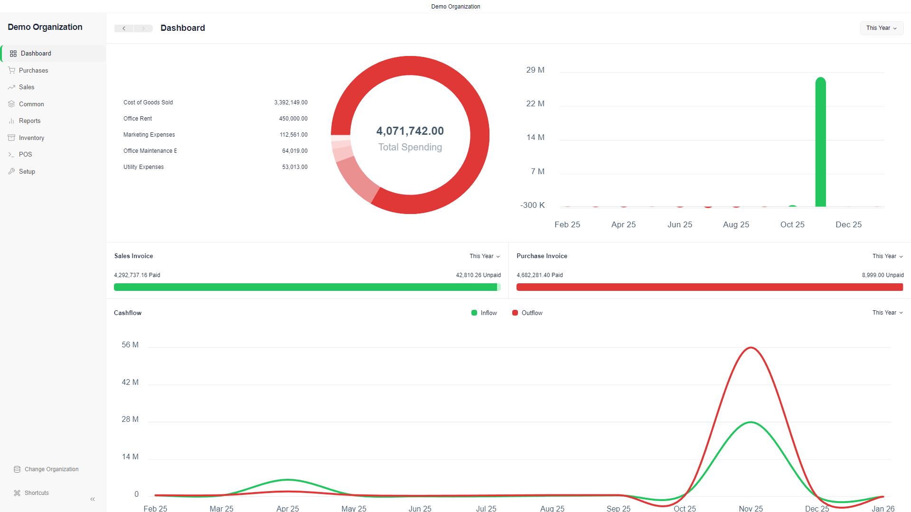

<div align="center">
  
</div>

# Accountinite

### *Accounting Ignited*

Accountinite is a free and open-source desktop accounting application designed to help SMEs manage their finances efficiently. Built with modern technologies, it provides a complete accounting solution including invoicing, inventory management, point of sale, and financial reporting; all with an offline-first approach.

<div align="center">
  
</div>

---

## 🚀 Features

* **Double-Entry Bookkeeping**
  Complete accounting system with chart of accounts and general ledger

* **Point of Sale (POS)**
  Integrated POS system for retail and sales transactions

* **Inventory Management**
  Track stock levels, batches, and serial numbers

* **Financial Reporting**
  Balance sheets, profit & loss statements, trial balances, and general ledgers

* **Customer & Supplier Management**
  Manage contacts, invoices, and transaction history

* **Journal Entries**
  Record complex and manual accounting entries

* **Loyalty Programs**
  Track and manage customer loyalty points

* **Pricing Rules & Coupons**
  Advanced pricing and discount strategies

* **Invoicing**
  Create and manage sales and purchase invoices

* **Payment Processing**
  Support for multiple payment methods and partial payments

* **Data Import & Export**
  CSV-based import and export functionality

* **Offline-First**
  Works completely offline with secure local data storage

---

## 🛠 Technology Stack

* **Frontend**: Vue.js 3 + TypeScript
* **Desktop Framework**: Electron
* **Backend**: TypeScript
* **Database**: Better-SQLite3
* **Styling**: Tailwind CSS
* **Build Tool**: Vite
* **Language**: TypeScript

---

## 📦 Installation (Developers)

### Prerequisites

* Node.js (Latest LTS version)
* npm or yarn package manager

### Development Setup

1. Clone the repository:

   ```bash
   git clone https://github.com/codeconomics-tz/accountinite.git
   cd accountinite
   ```

2. Install dependencies:

   ```bash
   yarn install
   ```

3. Run the application in development mode:

   ```bash
   yarn dev
   ```

### Building for Production

To create distributable builds:

```bash
yarn build
```

---

## 🧱 Architecture

Accountinite follows a modular and scalable architecture:

* **Core Models** – Base accounting entities (Invoices, Parties, Items, etc.)
* **Database Layer** – Abstraction over SQLite
* **Schema System** – Flexible data definitions
* **Report Engine** – Advanced financial reporting
* **Regional Compliance** – Country-specific accounting features

---

## 📂 Key Modules

* **Accounting** – Double-entry bookkeeping and ledgers
* **Inventory** – Stock tracking and valuation
* **Sales** – Sales invoices, quotes, customers, POS
* **Purchases** – Purchase invoices and supplier management
* **Reporting** – Financial statements and analytics
* **Setup** – Company configuration and chart of accounts

---

## 💻 Supported Platforms

* **Windows** – Portable and EXE installers
* **Linux** – DEB, AppImage, and RPM packages

---

## 📄 License

This project is licensed under the **AGPL-3.0 License**.
See the `LICENSE` file for details.

---

## 🙏 Acknowledgments

Accountinite is developed by **Codeconomics** and builds upon experience gained from developing **Frappe Books**.

---

## 📬 Support

For support or inquiries, please contact:
**[codeconomics.tz@gmail.com](mailto:codeconomics.tz@gmail.com)**

---
